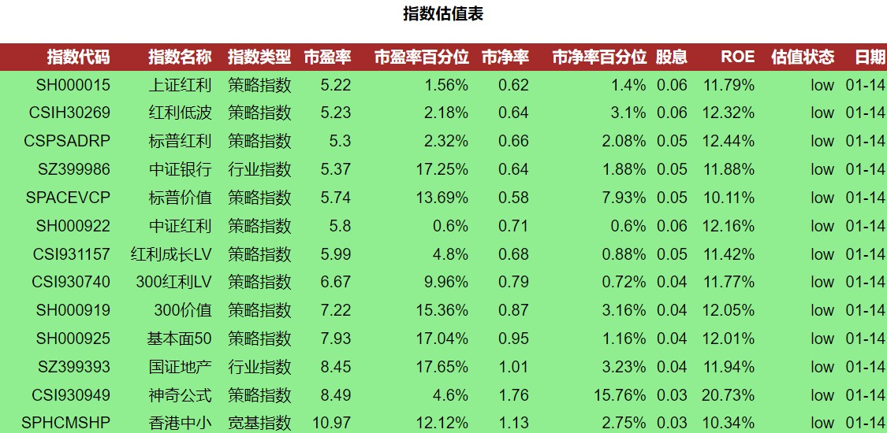

## Stock Index Evaluation

This scripts get data from [DanJuan](https://danjuanfunds.com/) website and store the specified index evaluation data which is used for investement decision. The dataset is located at [here](https://danjuanfunds.com/djmodule/value-center?channel=1300100141).

Step 1: change your mail address, and mail services and running command

```
# switch into the script folder
python main.py
```

Step 2: check you mail box and you will get an email like:



meanwhile, you can have one csv file in the script folder.
