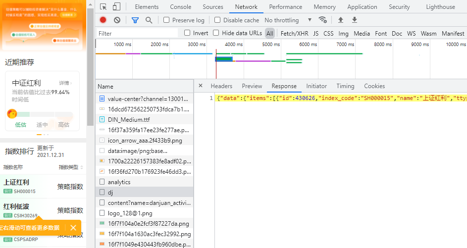

## Get data from web page with Javascript

I can't get the data from the downloaded page content as there was Javascript to load the data according to users operation (can search `v-for="(item,index) in list` to confirm about this). using the "requests" I only get the below content:

```
[<div :style="{height: (list.length*60)/16 + 'rem'}" class="out-row">
	<div :class="'bg-' + item.eva_type" :key="item.id" :style="{top: index*(60/16) + 'rem'}" @click="trackUserClick(item)" class="name" v-for="(item,index) in list">
		<div class="con"><h1>{{item.name}}</h1>
			<div class="color-bar-content"><span :class="item.eva_type" class="color-bar"></span><small>{{item.index_code}}</small></div>
		</div>
	</div>
	<div @scroll="handleScrollHoriz" class="in-row">
		<div :class="'bg-' + item.eva_type" :key="item.id" @click="trackUserClick(item)" class="row normal" v-for="item in list">
			<div class="ttype">{{renderTtype(item.ttype)}}</div>
			<div class="pe">{{numeral(item.pe).format('0,00.00')}}</div>
			<div class="pe-per">{{numeral(item.pe_percentile * 100).format('0,00.00') + '%'}}</div>
			<div class="pb">{{numeral(item.pb).format('0,00.00')}}</div>
			<div class="pb-per">{{numeral(item.pb_percentile * 100).format('0,00.00') + '%'}}</div>
			<div class="dyr">{{numeral(item.yeild * 100).format('0,00.00') + '%'}}</div>
			<div class="roe">{{numeral(item.roe * 100).format('0,00.00') + '%'}}</div>
			<div class="begin">{{item.peg?numeral(item.peg).format('0,00.00'):'--'}}</div>
		</div>
	</div>
</div>]
```

There are 3 ways to tackle this problem:

- Using `selenium` with Firefox web driver
- Using `phantomJS`
- Making an API using a REST client or python `request`

According to the guide [Data Science Skills: Web scraping javascript using python](https://towardsdatascience.com/data-science-skills-web-scraping-javascript-using-python-97a29738353f) I can found the responds as below:



Then when check keep the request URL (https://danjuanfunds.com/djapi/index_eva/dj) and test in web browser and it can respond the content what I need by accessing the request URL:

```
{"data":{"items":[{"id":430690,"index_code":"SH000015","name":"上证红利","ttype":"2","pe":5.1903,"pb":0.6126,"pe_percentile":0.0136,"pb_percentile":0.0108,"roe":0.118,"yeild":0.0604,"ts":1641225600000,"eva_type":"low","eva_type_int":0,"url":"","bond_yeild":0.05,"begin_at":1316448000000,"created_at":1641292701215,"updated_at":1641292701215,"peg":0.4652,"pb_flag":false,"date":"01-04","pb_over_history":0.9892,"pe_over_history":0.9864},{"id":430662,"index_code":"CSIH30269","name":"红利低波","ttype":"2","pe":5.2055,"pb":0.6417,"pe_percentile":0.0209,"pb_percentile":0.0301,"roe":0.1233,"yeild":0.0562,"ts":1641225600000,"eva_type":"low","eva_type_int":0,"url":"https://danjuanfunds.com/funding/005279?channel=1800100001&source=guzhi__web_20171001","bond_yeild":0.05,"begin_at":1387382400000,"created_at":1641292701215,"updated_at":1641292701215,"peg":0.604,"pb_flag":false,"date":"01-04","pb_over_history":0.9699,"pe_over_history":0.9791},
```

We can now get the evaluation data directly and use the json result:

```
response = requests.get('https://danjuanfunds.com/djapi/index_eva/dj', headers=headers, proxies=proxies)

with open('dj.json', 'w') as outfile:
    json.dump(response.json(), outfile, sort_keys=True, indent=4)
```

Regarding the charset problem when dump the data, please set the 'utf-8' charset for the file and add `ensure_ascii=False` option when dump the data.

reference:

- [vue.js中v-for的使用及索引获取](https://www.cnblogs.com/xulei1992/p/6015416.html)
- [Data Science Skills: Web scraping javascript using python](https://towardsdatascience.com/data-science-skills-web-scraping-javascript-using-python-97a29738353f)
- [HTTP requests and JSON parsing in Python](https://stackoverflow.com/questions/6386308/http-requests-and-json-parsing-in-python)
- [Saving utf-8 texts with json.dumps as UTF8, not as \u escape sequence](https://stackoverflow.com/questions/18337407/saving-utf-8-texts-with-json-dumps-as-utf8-not-as-u-escape-sequence)
