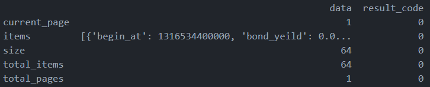

## How to extract the dataset from json and convert to csv

Now I can get the json format data from the web site, but what's the next step to extract the needed records from the json file ?

```
{
    "data": {
        "current_page": 1,
        "items": [
            {
                "begin_at": 1316448000000,
                "bond_yeild": 0.05,
                "created_at": 1641292701215,
                "date": "01-04",
                "eva_type": "low",
                "eva_type_int": 0,
                "id": 430690,
                "index_code": "SH000015",
                "name": "上证红利",
                "pb": 0.6126,
                "pb_flag": false,
                "pb_over_history": 0.9892,
                "pb_percentile": 0.0108,
                "pe": 5.1903,
                "pe_over_history": 0.9864,
                "pe_percentile": 0.0136,
                "peg": 0.4652,
                "roe": 0.118,
                "ts": 1641225600000,
                "ttype": "2",
                "updated_at": 1641292701215,
                "url": "",
                "yeild": 0.0604
            },
            {
                "begin_at": 1387382400000,
                "bond_yeild": 0.05,
                "created_at": 1641292701215,
                "date": "01-04",
                "eva_type": "low",
                "eva_type_int": 0,
                "id": 430662,
                "index_code": "CSIH30269",
                "name": "红利低波",
                "pb": 0.6417,
                "pb_flag": false,
                "pb_over_history": 0.9699,
                "pb_percentile": 0.0301,
                "pe": 5.2055,
                "pe_over_history": 0.9791,
                "pe_percentile": 0.0209,
                "peg": 0.604,
                "roe": 0.1233,
                "ts": 1641225600000,
                "ttype": "2",
                "updated_at": 1641292701215,
                "url": "https://danjuanfunds.com/funding/005279?channel=1800100001&source=guzhi__web_20171001",
                "yeild": 0.0562
            },
```

When I read `pd.read_json()` to parse the json, it can't get the expected result. That is, what I needed are the items" data in the json file.



According to [JSON in Python](https://www.w3schools.com/python/python_json.asp) I know that the json object in python is an dictionary, so the `jason()['data']['items']` will return the evaluation list.

Then we can use the python list to create pandas DataFrame data structure and use `to_csv()` to store the dataset.

Reference:

- [JSON in Python](https://www.w3schools.com/python/python_json.asp)
