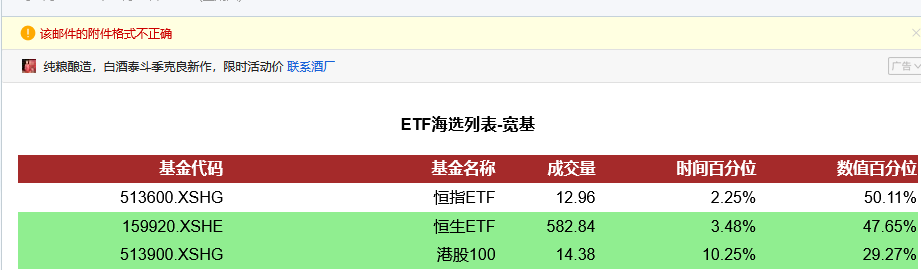

## Why error in email format ?

My orginal message was constructed by below code, which was changed by another script which using attachment:

```
msg = EmailMessage()

# 填充邮件头部
msg['Subject'] = '指数估值 - ' + str(datetime.date.today())
msg['From'] = 'lianbch@163.com'
msg['To'] = 'lianbch@163.com'

# 填充邮件正文
html = self._head \
       + self.construct_valuation_table() \
       + self._tail
msg.add_attachment(html, subtype='html')
```

I can receive the email and display the content normally, but with one error prompt as below:



Here we are not necessary to use `add_attachment`, but only use `set_content`. One preferable way to use `add_alternative` so that we can provide the plain content for those who didn't support `html` display.

```
msg.set_content(html, subtype='html')
```
